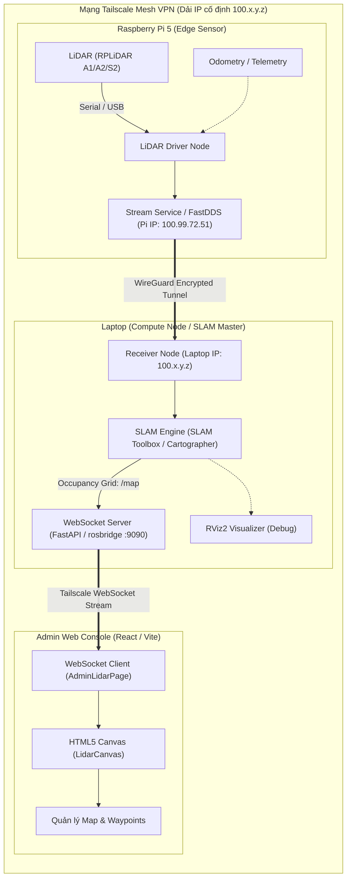

# KIẾN TRÚC & QUY TRÌNH LIDAR SLAM PHÂN TÁN (DISTRIBUTED SLAM GUIDE)
> **Dự án:** Hệ thống Trợ lý Robot Khách Sạn (HC-Robot)  
> **Mô hình triển khai:** Mô hình 1 — Xử lý tính toán tập trung trên Laptop (Off-board Computing), Raspberry Pi đóng vai trò Edge Sensor Hub, Web Console hiển thị bản đồ trực quan cho Admin.

---

## 1. TỔNG QUAN KIẾN TRÚC (HIGH-LEVEL ARCHITECTURE)

Hệ thống được thiết kế theo kiến trúc **Distributed Robotics Computing** kết nối qua mạng an toàn **Tailscale Mesh VPN**:
* **Raspberry Pi (Edge Node - IP Tailscale `100.x.y.z`):** Thu thập dữ liệu thô từ cảm biến LiDAR qua USB/UART và truyền stream dữ liệu qua đường hầm mã hóa Tailscale.
* **Laptop (Compute Node / SLAM Master - IP Tailscale `100.x.y.z`):** Nhận stream dữ liệu, chạy thuật toán SLAM (Simultaneous Localization and Mapping) để tính toán ma trận lưới không gian (Occupancy Grid) và vị trí robot, đồng thời mở cổng WebSocket qua `rosbridge_server` hoặc FastAPI WebSocket router.
* **Web Admin Console (Frontend UI):** Kết nối trực tiếp qua IP Tailscale vào cổng WebSocket (ví dụ: `ws://100.x.y.z:8000/api/v1` hoặc `ws://100.x.y.z:9090`), render bản đồ phòng lên thẻ HTML5 Canvas (`LidarCanvas.jsx`) theo thời gian thực và quản lý waypoints/lưu trữ bản đồ.



---

## 2. PHÂN CHIA NHIỆM VỤ CHI TIẾT

### A. Raspberry Pi (Edge Sensor Hub)
* **Phần cứng kết nối:** Cổng USB hoặc UART của Pi kết nối với module chuyển đổi của LiDAR (chú ý cấp đủ dòng 5V/2A cho Pi khi quay motor LiDAR).
* **Nhiệm vụ phần mềm:**
  - Chạy driver cảm biến (ví dụ: package `rplidar_ros` hoặc script đọc dữ liệu tia quét).
  - Xuất dữ liệu LaserScan dạng chuẩn (góc quét $\theta$, cự ly đo được $r$, cường độ phản xạ `intensities`).
  - Giao tiếp ra ngoài qua cổng mạng Tailscale (tần số quét ~7 - 10 Hz).
* **Mức tiêu thụ tài nguyên:** CPU chỉ chiếm khoảng 3% – 6%, RAM < 150MB, giúp Pi chạy mát mẻ, tiết kiệm pin tối đa.

### B. Mạng kết nối: Tailscale Mesh VPN (Đang áp dụng)
* **Lợi ích cốt lõi:**
  - **IP cố định dạng `100.x.y.z`:** Không bao giờ bị đổi IP khi robot chuyển trạm Wi-Fi giữa các tầng khách sạn.
  - **Bảo mật tuyệt đối:** Lưu lượng truyền dữ liệu LiDAR, camera và điều khiển được mã hóa đầu-cuối qua WireGuard.
  - **Xuyên NAT/Firewall:** Laptop và Pi 5 có thể kết nối với nhau kể cả khi khác mạng Wi-Fi (ví dụ: Pi 5 dùng 4G/Wi-Fi khách sạn, Laptop ở phòng kỹ thuật).
* **Cấu hình kết nối:**
  - Cả Laptop và Pi 5 đều cài và đăng nhập cùng mạng Tailscale:
    ```bash
    # Kiểm tra trạng thái trên Pi và Laptop
    tailscale status
    tailscale ping 100.x.y.z
    ```
  - **Lưu ý với ROS 2 DDS qua Tailscale:**
    - Vì Tailscale là mạng định tuyến Layer 3 (TUN) không hỗ trợ Multicast Broadcast mặc định, nên để 2 node ROS 2 nhận diện nhau qua Tailscale cần sử dụng:
      1. **FastDDS Discovery Server** (chỉ định trực tiếp IP Tailscale của Laptop làm server trung tâm).
      2. **Hoặc cấu hình CycloneDDS Unicast XML** (liệt kê IP `100.x.y.z` của đối tác vào danh sách `Peers`).
      3. **Hoặc dùng cầu nối Socket/WebSocket trực tiếp** (Pi mở stream TCP/WebSocket qua IP `100.x.y.z`, Laptop kết nối trực tiếp nhận gói tin).

### C. Laptop (SLAM Master & WebSocket Bridge)
* **Thuật toán SLAM:**
  - Khuyến nghị sử dụng **SLAM Toolbox (LifeLong Mapping / Async Online)** hoặc **Google Cartographer**.
  - Xử lý bài toán Loop Closure (khép vòng phòng) và loại bỏ nhiễu tia quét khi robot di chuyển.
  - Xuất kết quả liên tục ra topic `/map` (định dạng `nav_msgs/OccupancyGrid`: gồm metadata `width`, `height`, `resolution` và mảng 1D xác suất vật cản $[-1, 100]$).
* **Dịch vụ Cầu nối Web (rosbridge_server):**
  - Mở cổng WebSocket (mặc định port `9090`).
  - Tự động chuyển đổi các tin nhắn ROS (binary / struct) thành định dạng JSON để Web Browser có thể đọc trực tiếp.

### D. Web Admin Console (React / Vite Frontend)
* **Thành phần hiện có:** Giao diện [AdminLidarPage.jsx](file:///f:/DoAn/HC-Robot/frontend/src/pages/admin/AdminLidarPage.jsx) và canvas render [LidarCanvas.jsx](file:///f:/DoAn/HC-Robot/frontend/src/components/admin/LidarCanvas.jsx).
* **Kết nối qua Tailscale:**
  - Khai báo IP Tailscale của Pi hoặc Laptop trong `.env`:
    ```env
    VITE_PI5_IP=100.99.72.51
    ```
  - Web Admin mở kết nối WebSocket trực tiếp: `ws://${VITE_PI5_IP}:8000/api/v1` (hoặc cổng rosbridge `:9090`).
* **Cơ chế hiển thị trên Canvas:**
  - Lắng nghe payload chứa mảng điểm lưới `gridData` và metadata (`width`, `height`, `resolution`, `origin_x`, `origin_y`).
  - Phân loại giá trị điểm lưới:
    - `-1`: Vùng chưa quét (màu xám nhạt).
    - `0`: Vùng trống có thể di chuyển (màu trắng hoặc nền sàn).
    - `100`: Vật cản / Bức tường (màu đen hoặc viền xanh đậm).
  - Tọa độ Robot: Vẽ đè vị trí $(x, y, \theta)$ hiện tại của robot lên bản đồ để Admin quan sát đường đi trực quan và ghim Waypoints.

---

## 3. VÒNG ĐỜI VẬN HÀNH THỰC TẾ (WORKFLOW)

Quy trình sử dụng trong khách sạn chia thành **2 giai đoạn độc lập**:

### Giai đoạn 1: Dựng bản đồ ban đầu (Mapping Phase - Chỉ làm 1 lần)
1. **Khởi động:**
   - Cấp nguồn cho Robot (Pi tự chạy node LiDAR).
   - Đảm bảo Tailscale đã online trên cả 2 máy (`tailscale ping 100.x.y.z`).
   - Mở Laptop chạy SLAM node và WebSocket bridge server.
   - Admin truy cập trang Web `AdminLidarPage`, màn hình hiển thị trạng thái kết nối WebSocket sẵn sàng.
2. **Quét phòng:**
   - Điều khiển robot (bằng bàn phím WASD `laptop_teleop_wasd.py`, tay cầm, hoặc nút bấm điều khiển) di chuyển chậm quanh phòng.
   - Quan sát trên Web Canvas hoặc RViz2: các bức tường và góc khuất dần hiện rõ.
3. **Lưu bản đồ (Save Map):**
   - Khi căn phòng đã quét kín, Admin bấm nút **"Lưu bản đồ"** trên Web (hoặc gọi dịch vụ `map_server`).
   - Kết quả xuất ra 2 file:
     - `hotel_room.pgm` (ảnh đen trắng của căn phòng).
     - `hotel_room.yaml` (metadata: tọa độ gốc, độ phân giải mét/pixel).

### Giai đoạn 2: Vận hành & Phục vụ (Navigation & Service Phase)
* Robot không cần chạy thuật toán SLAM nữa (tiết kiệm tài nguyên tuyệt đối).
* Hệ thống tải trực tiếp file bản đồ đã lưu sẵn lên Web Admin.
* LiDAR trên Pi lúc này chỉ làm 2 việc:
  1. **AMCL Localization:** Xác định robot đang đứng ở góc nào trong căn phòng có sẵn.
  2. **Tránh vật cản di động (Obstacle Avoidance):** Phát hiện khách hàng, vali, bàn ghế mới kê để robot tự dừng hoặc né tránh.

---

## 4. CHECKLIST KỸ THUẬT & LƯU Ý KHI TRIỂN KHAI

| Hạng mục | Lưu ý kỹ thuật |
| :--- | :--- |
| **Mạng Tailscale** | Kiểm tra IP ảo `100.x.y.z` của Pi (`100.99.72.51`) và Laptop. Đảm bảo `tailscale ping` thông suốt trước khi bật stream dữ liệu. |
| **Đặc thù ROS 2 DDS qua Tailscale** | Tailscale không hỗ trợ multicast LAN. Cần cấu hình FastDDS Discovery Server hoặc CycloneDDS Unicast Peers trỏ thẳng vào IP Tailscale. |
| **Nguồn điện LiDAR** | Động cơ quay của LiDAR lúc khởi động có thể tụt áp. Cần dùng nguồn 5V/3A chuẩn hoặc cấp nguồn riêng cho module driver nếu dùng Pi 4/5. |
| **Baudrate Serial** | RPLiDAR A1 thường dùng baudrate `115200`, RPLiDAR A2/A3/S2 dùng `256000` hoặc cao hơn. Cần cấu hình đúng trong file launch. |
| **Resolution bản đồ** | Mức độ phân giải đề xuất là $0.05\text{m}$ (5cm/pixel). Đây là tỉ lệ vàng giữa độ chi tiết của tường và độ nhẹ của mảng dữ liệu truyền lên Web. |
